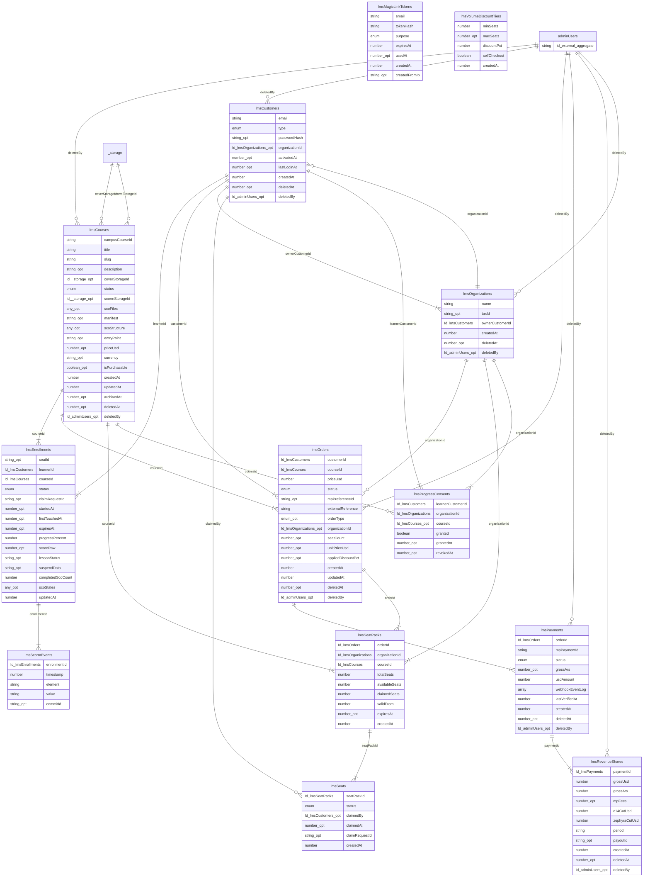

# Data Model: Zephyra LMS — Sprint 3a (Sales Pack + Org Admin — revenue spine)

**Date**: 2026-06-23
**Branch**: `feature/010-zephyra-lms-packs`
**Base commit**: `e71dfa3`
**Convex dev deploy**: `dev:exuberant-corgi-88` (schema pushed + validated `convex dev --once` → OK)
**Source**: SDD Sprint 3a (Sales Pack + Org Admin) + commercial §9.1 / §9.x volume bands.
**Status**: **FROZEN CONTRACT** — the backend phase binds its mutations/queries to this. Do not start backend until this is the schema of record.

This document is the schema **handoff contract** for the backend phase. It lists
every new table, every additive column on existing tables, every index, the one
typed migration, the invariants the mutations must enforce, the seat-mint branch
point, and the auto-generated ER diagram.

## Namespace + additive discipline

All Sprint 3a tables keep the `lms*` prefix. The change is **additive**: the 11
institutional tables and the 8 prior LMS tables keep their existing shape, with a
single documented exception — the typed-narrow of `lmsCustomers.organizationId`
(see "Typed migration" below).

Soft-delete pattern inherited from the repo: `deletedAt?: number, deletedBy?: Id<"adminUsers">`.
**Seats are the deliberate exception** — seat lifecycle is a `status` change, not
a soft-delete, because the actor is an `org_admin` (`lmsCustomers`), not `adminUsers`.

---

## 1. New tables

### `lmsOrganizations`

Buyer-organization aggregate. One row per organization.

| Campo | Tipo | Notas |
|-------|------|-------|
| `name` | `string` | Razón social. |
| `taxId` | `string?` | CUIT / tax id. Opcional al crear. |
| `ownerCustomerId` | `Id<"lmsCustomers">` | El **único** Owner Admin (un `lmsCustomers` con `type: "org_admin"`). |
| `createdAt` | `number` | |
| `deletedAt` | `number?` | Soft-delete (admin-initiated). |
| `deletedBy` | `Id<"adminUsers">?` | |

**Índices:** `by_owner` — `["ownerCustomerId"]`

**Decisión (diverge del SDD draft): un solo `ownerCustomerId`, no `adminCustomerIds: Id[]`.**
El draft del SDD sugería un array de admins. Commercial §9.1 **bloquea** un único
Owner Admin sin matriz de roles. Modelamos un solo `ownerCustomerId` (más limpio,
matchea el lock, evita una N-N prematura). Reintroducir multi-admin más adelante es
en sí mismo un cambio aditivo (nueva tabla junction o columna array nullable).

---

### `lmsSeatPacks`

Seat-pack aggregate. **Un pack = un order pagado = un curso.**

| Campo | Tipo | Notas |
|-------|------|-------|
| `orderId` | `Id<"lmsOrders">` | El order pack pagado que originó el pack. **UNIQUE** (app-enforced) — clave de idempotencia del mint. |
| `organizationId` | `Id<"lmsOrganizations">` | Org dueña del pack. |
| `courseId` | `Id<"lmsCourses">` | Un pack otorga seats para **exactamente un** curso. |
| `totalSeats` | `number` | Seats comprados. |
| `availableSeats` | `number` | Pool sin reclamar. |
| `claimedSeats` | `number` | Seats actualmente en manos de un learner. |
| `validFrom` | `number` | |
| `expiresAt` | `number?` | **VESTIGIAL / nullable.** Licencias vitalicias en V1 → siempre `null` al mintear. Ver ADR-0013. |
| `createdAt` | `number` | |

**Índices:** `by_order` — `["orderId"]` (UNIQUE app-enforced, lookup de idempotencia del mint) · `by_organization` — `["organizationId"]`

---

### `lmsSeats`

Seat aggregate. Una fila por seat de un pack. Lifecycle = cambio de `status`, **no** soft-delete.

| Campo | Tipo | Notas |
|-------|------|-------|
| `seatPackId` | `Id<"lmsSeatPacks">` | Pack al que pertenece. |
| `status` | `"available" \| "claimed" \| "released"` | **NO existe `"expired"` en V1** (licencias vitalicias). `released` = devuelto al pool, re-reclamable. |
| `claimedBy` | `Id<"lmsCustomers">?` | El `org_learner` que lo tiene. |
| `claimedAt` | `number?` | |
| `claimRequestId` | `string?` | Idempotencia del claim. |
| `createdAt` | `number` | |

**Índices:** `by_seatpack_status` — `["seatPackId", "status"]` · `by_claim_request` — `["claimRequestId"]`

---

### `lmsProgressConsents`

**Gate de privacidad.** El progreso nominal (nombre + progreso del learner) es
legible por el org admin **solo** cuando existe una fila acá con `granted: true`
para el par (learner, org).

| Campo | Tipo | Notas |
|-------|------|-------|
| `learnerCustomerId` | `Id<"lmsCustomers">` | El learner. |
| `organizationId` | `Id<"lmsOrganizations">` | La org. |
| `courseId` | `Id<"lmsCourses">?` | `null` ⇒ consentimiento org-wide; presente ⇒ acotado a un curso. |
| `granted` | `boolean` | |
| `grantedAt` | `number?` | |
| `revokedAt` | `number?` | |

**Índices:** `by_learner_org` — `["learnerCustomerId", "organizationId"]`

---

### `lmsVolumeDiscountTiers`

Config de bandas de descuento por volumen. Permite a Zephyra ajustar las bandas
**sin cambio de código**. El servidor es autoritativo sobre qué banda aplica a un `seatCount`.

| Campo | Tipo | Notas |
|-------|------|-------|
| `minSeats` | `number` | Piso de la banda (inclusive). |
| `maxSeats` | `number?` | Techo (inclusive). `null` = banda abierta (top band). |
| `discountPct` | `number` | 0–100. |
| `selfCheckout` | `boolean` | `false` ⇒ "Contactanos" (sin self-serve). |
| `createdAt` | `number` | |

**Índices:** `by_min_seats` — `["minSeats"]` (lookup de banda por seatCount; sin full-scan)

**Seed bands (sembradas por el backend — documentadas, no necesariamente insertadas en la fase de schema):**

| minSeats | maxSeats | discountPct | selfCheckout |
|----------|----------|-------------|--------------|
| 1 | 9 | 0 | true |
| 10 | 24 | 10 | true |
| 25 | 49 | 20 | true |
| 50 | _(null)_ | _(custom)_ | **false** ("Contactanos") |

> Nota: para la banda 50+ el `discountPct` es custom/negociado; el seed puede dejar
> un placeholder (p.ej. `0`) pero lo decisivo es `selfCheckout: false`, que corta el
> camino de auto-checkout y dispara el flujo "Contactanos".

---

## 2. Additive columns on existing tables

### `lmsOrders` (additive — todo opcional, semántica default-b2c en código)

| Campo nuevo | Tipo | Notas |
|-------------|------|-------|
| `orderType` | `("b2c" \| "pack")?` | **AUSENTE ⇒ tratar como `"b2c"`.** Discrimina el branch del seat-mint. |
| `organizationId` | `Id<"lmsOrganizations">?` | Seteado solo en orders pack. |
| `seatCount` | `number?` | Pack: cantidad de seats. |
| `unitPriceUsd` | `number?` | Pack: precio de lista por seat (USD) **antes** del descuento. |
| `appliedDiscountPct` | `number?` | Pack: descuento de banda aplicado (0–100). |

`priceUsd` (existente, no se toca) sostiene el **total server-computed** del pack
(= `seatCount × unitPriceUsd × (1 − appliedDiscountPct/100)`). El cliente nunca
computa el total; el servidor es autoritativo.

**Índice nuevo:** `by_org_course_status` — `["organizationId", "courseId", "status"]`
— soporta reusar un order pack `pending_payment` abierto en un retry (buscar un pack
impago para el mismo org+course antes de crear uno nuevo).

### `lmsEnrollments` (additive)

- Campo `seatId` (ya existía como `string?`) — sin cambio de tipo.
- **Índice nuevo:** `by_seat` — `["seatId"]`. **UNIQUE (app-enforced)** — un enrollment por seat reclamado.

---

## 3. Typed migration (NO pure-additive — documentado y verificado)

**`lmsCustomers.organizationId`: `v.optional(v.string())` → `v.optional(v.id("lmsOrganizations"))`.**

- Es un **type-narrow sobre una columna existente** (placeholder string de Sprint 1 → FK tipada ahora que existe el agregado org).
- **Verificado seguro @ `e71dfa3`** contra `dev:exuberant-corgi-88`: hay 4 filas en `lmsCustomers`, todas `type: "individual"`, **cero** con `organizationId` seteado (la columna ni siquiera renderiza en `convex data` → todos `undefined`). No requiere backfill.
- **`convex dev --once` aceptó el narrow** contra los datos del dev deploy sin error de schema-validation (si hubiera un string no-null incompatible, Convex habría rechazado el push).
- Si en el futuro apareciera un valor string no-null antes de aplicar este schema en otro entorno: **STOP y flag** — no forzar.

---

## 4. Index rules applied (5)

1. **`lmsSeatPacks.by_order`** — mint idempotency lookup (UNIQUE app-enforced).
2. **`lmsSeats.by_seatpack_status`** — listar/contar seats por pack y estado (claim/release sin full-scan).
3. **`lmsSeats.by_claim_request`** + **`lmsEnrollments.by_seat` (UNIQUE)** — idempotencia de claim + un enrollment por seat.
4. **`lmsProgressConsents.by_learner_org`** — gate de privacidad O(1) por par (learner, org).
5. **`lmsOrders.by_org_course_status`** — reuso de order pack `pending_payment` en retry.

Adicional (cobertura, no full-scan): `lmsOrganizations.by_owner`, `lmsSeatPacks.by_organization`, `lmsVolumeDiscountTiers.by_min_seats`. Todos los índices nombrados `by_*`.

---

## 5. Invariants (el backend los enforcea en mutations — el schema no los constraintea)

- **Balance del seat-pack:** `availableSeats + claimedSeats ≤ totalSeats`, chequeado transaccionalmente en cada mint/claim/release.
- **Idempotencia de mint:** un `lmsSeatPacks` (+ sus `lmsSeats`) se crea **una sola vez** por order pagado, keyed en `orderId` (lookup-before-insert via `by_order`; `lmsPayments.mpPaymentId` UNIQUE es el backstop upstream del webhook).
- **Idempotencia de claim:** `claimSeat` busca por `claimRequestId` (`by_claim_request`) **antes** de insertar.
- **Condición de release:** un seat `claimed` es liberable **solo** si su enrollment muestra engagement cero en los tres: `progressPercent === 0 AND scoreRaw === null AND firstTouchedAt === null`. **Release = cambio de status** (`claimed → released`, seat vuelve al pool `available`), **NO** un soft-delete `deletedBy` (el actor es un `org_admin = lmsCustomers`, no `adminUsers`).
- **Privacidad:** el progreso nominal es alcanzable solo por un path que verifique `lmsProgressConsents.granted === true` para el par (learner, org).
- **`lmsOrders.orderType` ausente ⇒ `"b2c"`** (semántica default en código).

---

## 6. Seat-mint branch point (para la fase de backend)

`convex/lms/payment/internal.ts`, bloque **APPROVED** (~línea 168, dentro de `if (fetched.status === "approved")`).

Hoy ese bloque hace, en orden:
1. `insert("lmsPayments", ...)` (status approved)
2. `patch(order, { status: "paid" })`
3. `grantEnrollmentForOrder` (B2C: 1 enrollment para el buyer)
4. `recordRevenueShare`
5. (email al buyer)

**Branch a introducir:** sobre `order.orderType`.
- `orderType === "pack"` (o lo nuevo que sea explícitamente pack): en lugar de (3) `grantEnrollmentForOrder`, llamar al **mint del pack** (crear `lmsSeatPacks` + N `lmsSeats` `available`, keyed idempotente en `orderId` via `by_order`). El admin luego reclama seats; el enrollment se crea en el **claim**, no en el pago.
- `orderType` ausente o `"b2c"`: el path actual sin cambios.
- **`recordRevenueShare` (4) y el email al buyer quedan COMUNES** a ambos paths (el split 80/20 aplica igual al total del pack).

---

## 7. ER diagram (auto-generado, Mermaid `erDiagram`)

Generado determinísticamente parseando `convex/schema.ts` via AST (el transpiler
`convex-schema-to-mermaid` de plataforma es un gap conocido; se genera del schema
parseado, no a mano). **Compila con `@mermaid-js/mermaid-cli` (validado, EXIT 0).**
Convención de tipo: `_opt` = `v.optional`, `Id_<tabla>` = `v.id("<tabla>")`, `enum` = `v.union` de literales.
Cardinalidad: `||--|{` = FK requerida (1-N), `||--o{` = FK opcional (1-0..N).

---

## Frozen-contract checklist (DoD)

- [x] `convex/schema.ts` typechecks (`tsc --noEmit` EXIT 0).
- [x] `convex dev --once` push aceptado contra `dev:exuberant-corgi-88` (9 índices nuevos agregados; type-narrow aceptado contra datos vivos).
- [x] Todo aditivo/nullable; columnas B2C existentes intactas; type-narrow documentado + verificado seguro (0 filas no-null).
- [x] 5 reglas de índice respetadas; índices nombrados `by_*`.
- [x] ER Mermaid auto-generado y compilado (EXIT 0).
- [x] Contrato de schema escrito para la fase de backend (este doc).
